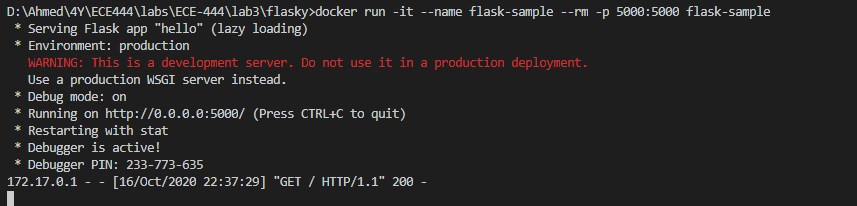
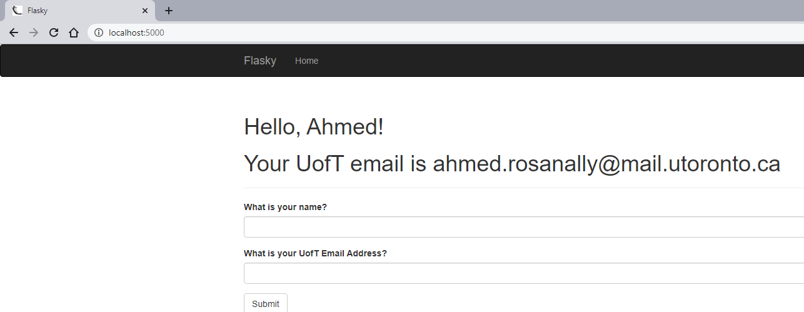
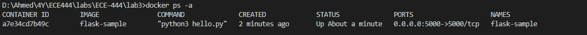

# ECE-444
Ahmed Rosanally

#### This repo is a clone of : https://github.com/miguelgrinberg/flasky

## How to build and start the system

First modify the Dockerfile in lab3/flasky to the following:

```docker
FROM python:3.7	
COPY . /app	
WORKDIR /app	
RUN pip install -r requirements.txt	
ENTRYPOINT ["python3"]	
CMD ["hello.py"]
```

Make sure to include the following dependencies in lab3/flasky/requirements.txt

```
alembic==1.4.3
black==20.8b1  # formatter
blinker==1.4
click==7.1.2
dominate==2.5.2
Flask==1.1.2
Flask-Bootstrap==3.3.7.1
Flask-Migrate==2.5.3
Flask-Moment==0.10.0
Flask-SQLAlchemy==2.4.4
Flask-WTF==0.14.3
itsdangerous==1.1.0
Jinja2==2.11.2
Mako==1.1.3
MarkupSafe==1.1.1
pylint==2.6.0  # linter
python-dateutil==2.8.1
python-editor==1.0.4
six==1.15.0
SQLAlchemy==1.3.19
Werkzeug==1.0.1
WTForms==2.3.3
email-validator==1.1.1
```

To build the system enter the following in the Windows command prompt

`docker build -t flask-sample:latest .`

To run the system enter the following in the Windows command prompt:

`docker run -it --name flask-sample --rm -p 5000:5000 flask-sample`

After running that command you should the following output in the command line:



Browser output:



To check the image:




