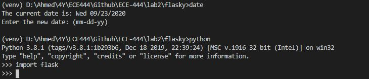
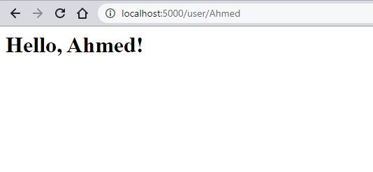

# ECE-444
Ahmed Rosanally

#### This repo is a clone of : https://github.com/miguelgrinberg/flasky

## Activity 1:

- Navigate to https://bitbucket.org/pypa/setuptools
- Obtain the script *ez_setup.py*
- Install flask locally:
    + clone the flask repo:
      ```
      $ git clone https://github.com/miguelgrinberg/flasky.git
      $ cd flasky
      $ git checkout 1a
      ```
    + Using *virtualenv*:
      ```
      $ virtualenv venv
      ```
    + On Microsoft do the following to activate the environment (obtaining a local Python intepreter)
      ```
      $ venv\Scripts\activate
      ```
    + Finally install flask:
      ```
      (venv) $ pip install flask
      (venv) $ python
      Python 3.8.1 (tags/v3.8.1:1b293b6, Dec 18 2019, 22:39:24) [MSC v.1916 32 bit (Intel)] on win32
      Type "help", "copyright", "credits" or "license" for more information.
      >>>
      ```
Expected output:



## Activity 2:

starter code:

```python
from flask import Flask
app = Flask(__name__)


@app.route('/')
def index():
    return '<h1>Hello World!</h1>'


@app.route('/user/<name>')
def user(name):
    return '<h1>Hello, {}!</h1>'.format(name)

if __name__ == '__main__':
    app.run(debug=True)
```



## Activity 3:

Flask context globals are objects that act as global imports (i.e. `from flask import request`), but that contain information relevant to only the current request or application. After the import, view functions can access the HTTP request, session, and data without having to add positional (`args`) or keyword arguments (`kwargs`) to them.

#### Summary of flask context globals

| Variable name  | Context | Description  |
| ------ | -------------- | -------------| 
| current_app | app context | The app instance for the active app | 
| g | app context | An obj. that the app can use to temp. storage during the request handling. This var. is reset w/ each request | 
| request | Request context | The request object, which encapsulates the contents of a HTTP request sent by a client | 
| session | Request context | The user session, a dictionay that the app can use to store values that are "remembered" b/w requests. |


