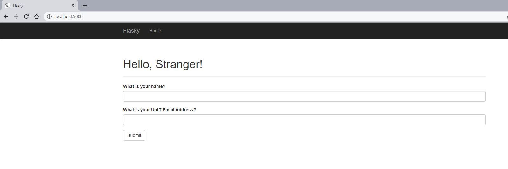
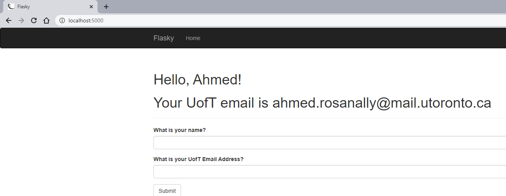
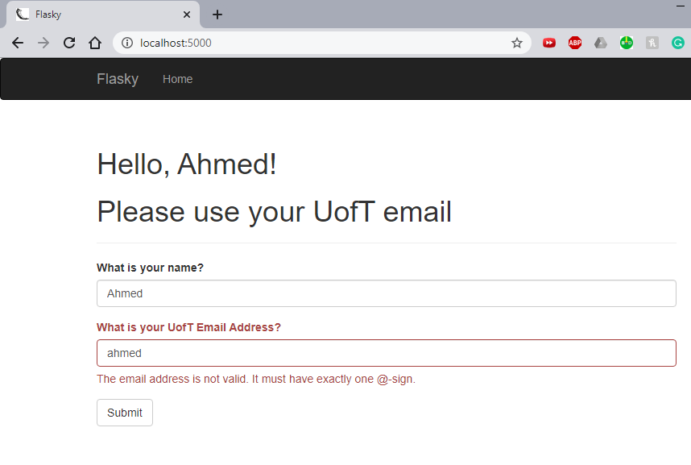
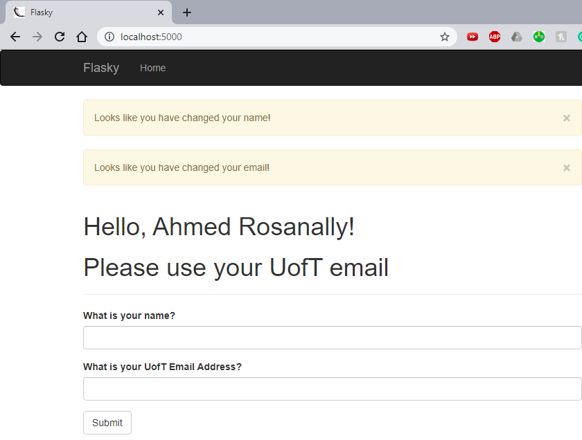

# ECE-444
Ahmed Rosanally

#### This repo is a clone of : https://github.com/miguelgrinberg/flasky

## Activity 1:

- Use virtualenv
- Install flask locally:
    + clone the flask repo:
      ```
      $ git clone https://github.com/miguelgrinberg/flasky.git
      $ cd flasky      


## Activity 2:









## Activity 3:

| SQL Databases | NoSQL Databases|
|-----|-------|
| Relational databases | Document-oriented or key-value databases |
| *Tables* that have a fixed number of *columns* and multiple *rows* | Use of *collections* instead of tables and *documents* instead of *records* (rows)|
| Use of schemas i.e. high-level definition of databases | Schema-free |
| Data stored efficiently, avoids data duplication (*normalization*) | Reduces the number of tables at the cost of data duplication (*denormalization*) which allows for faster querying |
| 
